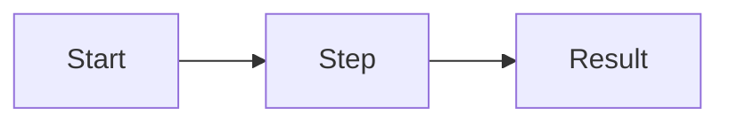
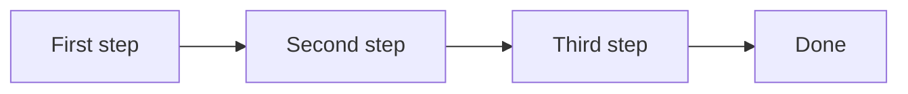

# /templates/ — English copy for review (#95)

For the owner. The English source of the first batch: the hub and three pages. Once approved, zh-Hant is written from it; zh-Hans and ja are machine drafts labelled needs-i18n (owner, 2026-09-25). The downloads (`spec.md`, `flowchart.md`, `meeting-notes.md`) are the templates below, byte for byte.

Every page has the same order: H1 and lede, the loop animation, the template (copy or download), how it looks (a real `marsdawn export` PDF page), a prompt for the agent, sharing it as a PDF, what it doesn't do, two FAQs, related templates. The App Store link follows the site's launch phase, like every other page.

---

## Hub: `/templates/`

- **Title:** Markdown templates · MarsDawn
- **Description:** Markdown templates for the documents an agent writes and you read: a spec, a flowchart and meeting notes, each with a prompt for your agent.
- **H1:** Markdown templates
- **Lede:** For the documents an agent writes and you read. Each template comes with a prompt for your agent, and opens in MarsDawn so you can read what it wrote.

List:
- **Spec (PRD):** problem, goals, requirements, a flow diagram and acceptance criteria.
- **Flowchart:** a Mermaid diagram with the steps written out below it.
- **Meeting notes:** decisions and action items, with owners.

---

## `/templates/spec/`

- **Title:** Spec and PRD template in Markdown · MarsDawn
- **Description:** A Markdown spec template with requirements, a Mermaid flow diagram and acceptance criteria. Your agent fills it in; you review it in MarsDawn.
- **H1:** Spec template (PRD) in Markdown
- **Lede:** A spec your agent can fill in and you can read in one sitting: the problem, goals, requirements, a flow diagram and acceptance criteria. When you change a requirement, ask the agent to bring the rest in line.

**Animation** (`spec.md`): the reader deletes "R3: Ask for a second factor." The agent removes the Second factor step from the flow, reconnects the diagram, and deletes R3's acceptance check.
- Terminal ask: `I dropped R3. Make the flow and the acceptance criteria agree.`
- Reply: `Done. The flow skips the second factor, and R3's check is gone.`
- Alt: A terminal opens spec.md in MarsDawn. The reader deletes requirement R3, and the agent removes its step from the flow diagram and its acceptance check.

**The template** (`spec.md`):

````markdown
# Spec: Feature name

Status: draft · Owner: name · Updated: date

## Problem

_What is wrong today, for whom, and how we know._

## Goals

- _What will be true when this ships._

## Non-goals

- _What this deliberately doesn't do._

## Requirements

| ID | Requirement | Priority |
|----|-------------|----------|
| R1 | _Requirement_ | Must |
| R2 | _Requirement_ | Should |

## Flow



## Acceptance criteria

- [ ] R1: _How we check it._
- [ ] R2: _How we check it._

## Open questions

- _Question._
````

**How it looks:** caption: "Exported with `marsdawn export spec.md`. The free command-line tool renders like MarsDawn's preview, diagram included."

**Ask your agent:**

> Write a spec for [the feature] in spec.md, using the template at https://marsdawn.southern-light.dev/templates/spec/spec.md. Give every requirement an ID, and use the same IDs in the flow and the acceptance criteria. When it's written, run `marsdawn open spec.md`.

**Share it as a PDF:** `marsdawn export spec.md --theme classic` writes spec.pdf beside it, for someone who doesn't read Markdown.

**What it doesn't do:** MarsDawn shows the spec, the table and the diagram. It doesn't check that the acceptance criteria cover every requirement. That's the agent's job, and your read.

**FAQ**
- *Does the flow diagram need anything installed?* No. MarsDawn and `marsdawn export` draw Mermaid themselves, offline.
- *Can I edit the spec in MarsDawn?* Yes. It's a Markdown editor with the preview beside the source. The agent sees your edit the next time it reads the file.

---

## `/templates/flowchart/`

- **Title:** Flowchart template in Markdown (Mermaid) · MarsDawn
- **Description:** A Mermaid flowchart template in Markdown, with the steps written out below it. Preview it on a Mac and export it to PDF.
- **H1:** Flowchart template in Markdown
- **Lede:** A Mermaid flowchart with the steps spelled out underneath, so the diagram and the words can be checked against each other. Take a step out, and ask the agent to fix the rest.

**Animation** (`flowchart.md`): in the diagram's source the reader deletes `B --> C[Legal]`; the preview drops the Legal step. The agent reconnects `C --> D` to `B --> D`, deletes step 3, and renumbers Publish.
- Ask: `I took Legal out of the diagram. Fix the edge and the steps.`
- Reply: `Done. Review goes straight to Publish, and the steps are renumbered.`
- Alt: A terminal opens flowchart.md in MarsDawn. The reader removes the Legal step from the Mermaid diagram, and the agent reconnects the diagram and renumbers the steps below it.

**The template** (`flowchart.md`):

````markdown
# Flow name

_One sentence: what goes in, what comes out._

## Diagram



## Steps

1. **First step:** _who does it, and what they hand on._
2. **Second step:** _…_
3. **Third step:** _…_
4. **Done:** _what "done" means here._
````

**How it looks:** as for the spec.

**Ask your agent:**

> Draw the flow for [the process] in flowchart.md, using the template at https://marsdawn.southern-light.dev/templates/flowchart/flowchart.md. Keep one numbered step per node, in the same order. When it's written, run `marsdawn open flowchart.md`.

**Share it as a PDF:** `marsdawn export flowchart.md` — the diagram is drawn into the PDF.

**What it doesn't do:** MarsDawn draws what the Mermaid says. It doesn't lay the diagram out by hand, and it doesn't keep the numbered steps in sync with the nodes. If the Mermaid has an error, the preview shows the error instead of a diagram.

**FAQ**
- *Which diagrams work?* Anything Mermaid draws: flowcharts, sequence diagrams, state diagrams and more.
- *Why write the steps out as well?* A reader who skims sees the diagram; a reader who checks needs the words. The agent can keep both in step.

---

## `/templates/meeting-notes/`

- **Title:** Meeting notes template in Markdown · MarsDawn
- **Description:** A Markdown meeting notes template with decisions and action items with owners. Your agent writes it up; you check it in MarsDawn.
- **H1:** Meeting notes template in Markdown
- **Lede:** Decisions first, then action items with an owner each. Let your agent write the notes from the transcript, and read them before they go out. If a decision changes, the action items follow.

**Animation** (`meeting-notes.md`): the reader changes the decision from 50 to 80 people. The agent changes all three action items to 80.
- Ask: `The beta is 80 people now. Update the action items.`
- Reply: `Done. All three action items say 80.`
- Alt: A terminal opens meeting-notes.md in MarsDawn. The reader changes a decision from 50 to 80 people, and the agent updates the three action items to match.

**The template** (`meeting-notes.md`):

````markdown
# Meeting name, date

Attendees: _names_

## Decisions

- _What was decided, in one line each._

## Action items

- [ ] Name: _what, by when._
- [ ] Name: _what, by when._

## Notes

- _Anything worth keeping that isn't a decision or an action._
````

**How it looks:** as for the spec.

**Ask your agent:**

> Write up this meeting in meeting-notes.md, using the template at https://marsdawn.southern-light.dev/templates/meeting-notes/meeting-notes.md. Decisions first, one line each; every action item gets one owner and a date. When it's written, run `marsdawn open meeting-notes.md`.

**Share it as a PDF:** `marsdawn export meeting-notes.md` writes a PDF you can attach to the follow-up mail.

**What it doesn't do:** MarsDawn doesn't record or transcribe the meeting, and it doesn't track the action items. It shows the notes as they'll be read.

**FAQ**
- *Do the checkboxes work?* They show as checkboxes in the preview and the PDF. Tick one by changing `[ ]` to `[x]` in the source.
- *Can the agent keep the notes and the action items in step?* Yes, that's the point of the loop: change one, and ask it to update the rest. MarsDawn shows you the result.
