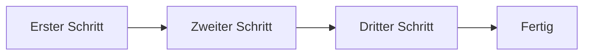

# Name des Ablaufs

_Ein Satz: was hineingeht, was herauskommt._

## Diagramm

## Schritte

1. **Erster Schritt:** _wer ihn erledigt und was er weitergibt._
2. **Zweiter Schritt:** _…_
3. **Dritter Schritt:** _…_
4. **Fertig:** _was „fertig“ hier bedeutet._
