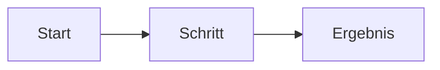

# Spezifikation: Name der Funktion

Status: Entwurf · Verantwortlich: Name · Aktualisiert: Datum

## Problem

_Was heute nicht stimmt, für wen, und woher wir das wissen._

## Ziele

- _Was gilt, wenn das ausgeliefert ist._

## Nicht-Ziele

- _Was das bewusst nicht tut._

## Anforderungen

| ID | Anforderung | Priorität |
|----|-------------|-----------|
| R1 | _Anforderung_ | Muss |
| R2 | _Anforderung_ | Soll |

## Ablauf

## Akzeptanzkriterien

- [ ] R1: _Wie wir es prüfen._
- [ ] R2: _Wie wir es prüfen._

## Offene Fragen

- _Frage._
