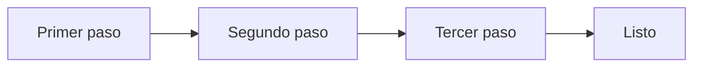

# Nombre del flujo

_Una frase: qué entra y qué sale._

## Diagrama

## Pasos

1. **Primer paso:** _quién lo hace y qué entrega al siguiente._
2. **Segundo paso:** _…_
3. **Tercer paso:** _…_
4. **Listo:** _qué significa «listo» aquí._
