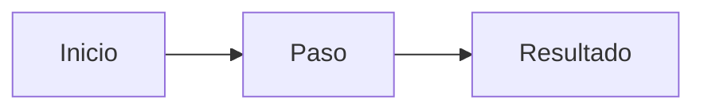

# Especificación: nombre de la función

Estado: borrador · Responsable: nombre · Actualizado: fecha

## Problema

_Qué falla hoy, a quién afecta y cómo lo sabemos._

## Objetivos

- _Qué será cierto cuando esto salga._

## Fuera de alcance

- _Lo que esto no hace, a propósito._

## Requisitos

| ID | Requisito | Prioridad |
|----|-----------|-----------|
| R1 | _Requisito_ | Obligatorio |
| R2 | _Requisito_ | Recomendado |

## Flujo

## Criterios de aceptación

- [ ] R1: _Cómo lo comprobamos._
- [ ] R2: _Cómo lo comprobamos._

## Preguntas abiertas

- _Pregunta._
