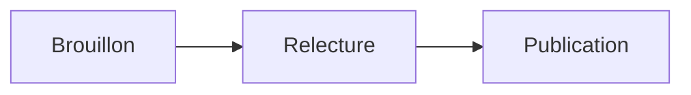

# Markdown en PDF sur Mac, en ligne de commande.

L’outil gratuit `marsdawn` transforme un fichier Markdown en PDF en une seule commande. Les tableaux, les formules, les diagrammes Mermaid et le code coloré sortent tels qu’on les lit dans la source, et rien d’autre n’est nécessaire, pas même l’app MarsDawn.

## L’installer

```
brew install redtear1115/tap/marsdawn
marsdawn --version
```

Sur un Mac à puce Apple, Homebrew installe une copie précompilée en quelques secondes. Sur un Mac Intel, il compile à partir des sources, ce qui prend quelques minutes et nécessite Xcode 26 ou version ultérieure. L’outil fonctionne sous macOS 15 ou version ultérieure, et `marsdawn --version` affiche la version installée.

## Enregistrer un document

Collez ceci dans un fichier nommé `plan.md` :

````
# Plan : des exports plus rapides

Un agent a rédigé ce plan. Vous le relisez, puis vous le transformez en PDF.

## Étapes

| Étape | Responsable | État |
|-------|-------------|------|
| Mesurer les pages lentes | Agent | Fait |
| Mettre en cache les diagrammes rendus | Agent | En relecture |

L'objectif est $t < 2\,\text{s}$ pour un document de 50 pages :

$$
t_{\text{total}} = \sum_{i=1}^{n} t_i
$$



```swift
let pdf = try export("plan.md")
```
````

## L’exporter

```
marsdawn export plan.md
```

Il écrit `plan.pdf` à côté de la source et indique où il l’a placé :

```
Exported /Users/you/plan.pdf (1 page)
```

Voici cette page, capturée lors d’une véritable exécution de `marsdawn` 0.5.0 :


## Choisir un thème, un format de papier et un nom de fichier

```
marsdawn export plan.md --theme classic --paper letter -o handout.pdf
```

- `--theme` : dawn, classic, modern ou vivid, dans les couleurs claires du thème. Sans cette option, `export` utilise `$MARSDAWN_THEME`, sinon dawn.
- `--paper` : a4 ou letter. La valeur par défaut est a4.
- `-o` : où écrire le PDF, au lieu de le placer à côté de la source.
- `--allow-remote-images` : charge les images du web pendant le rendu. Elles restent désactivées si vous ne le précisez pas.

## Si ça ne fonctionne pas

- `A full installation of Xcode.app 26.0 is required to compile this software.` Homebrew compile `marsdawn` à partir des sources, comme sur un Mac Intel. Installez Xcode 26 ou version ultérieure depuis l’App Store, puis relancez l’installation.
- `marsdawn: No such file: …` Le chemin ne mène pas à un fichier. Vérifiez le nom, ou lancez la commande depuis le dossier qui contient le fichier.
- `… already exists. Pass --force to replace it.` Un PDF portant ce nom existe déjà. Ajoutez `--force` pour le remplacer, ou `-o` pour l’écrire ailleurs.
- `Error: The value '…' is invalid for '--theme <theme>'.` Le thème ou le format de papier n’est pas reconnu. Les thèmes sont dawn, classic, modern et vivid ; le papier est a4 ou letter.

## Pour aller plus loin

- Toutes les options et le JSON produit : [Ligne de commande](/fr/cli/).
- Pour qu’un agent de code le fasse à votre place : [la compétence d’agent marsdawn](/fr/cli/skill/).
- Les quatre thèmes d’aperçu, et la direction que prend l’export PDF : [thèmes d’aperçu et export PDF](/fr/themes/).
- Remettre le PDF à quelqu’un qui n’utilise pas Markdown : [partager un PDF](/fr/sharing-exported-pdfs/).

## Plus

- [MarsDawn](https://marsdawn.southern-light.dev/fr/index.md): Du Markdown pour les humains qui pilotent le travail des agents : un éditeur Mac natif avec aperçu en direct, diagrammes Mermaid et export PDF. Sur le Mac App Store.
- [Vos textes restent sur votre Mac](https://marsdawn.southern-light.dev/fr/yours/index.md): MarsDawn n’a ni compte, ni synchronisation, ni cloud. Vos documents Markdown restent sur votre Mac, dans les fichiers et dossiers que vous choisissez.
- [Essai gratuit, achat unique](https://marsdawn.southern-light.dev/fr/pay-once/index.md): MarsDawn se télécharge gratuitement. Essayez tout pendant 14 jours, puis déverrouillez-le une fois pour 4,99 USD. Sans abonnement, sans compte.
- [Export PDF](https://marsdawn.southern-light.dev/fr/pdf/index.md): Exportez du Markdown en PDF ou imprimez-le sur votre Mac, avec les diagrammes Mermaid et le code en couleur. Les sauts de page évitent de couper les blocs de code courts et les tableaux.
- [Une app Mac](https://marsdawn.southern-light.dev/fr/native/index.md): Un éditeur Markdown qui est une vraie app Mac : fenêtres et onglets natifs, enregistrement automatique, historique des versions, Coup d’œil dans le Finder et un éditeur de texte qui se comporte comme sur Mac.
- [Ce que MarsDawn ne fait pas](https://marsdawn.southern-light.dev/fr/limits/index.md): Pas de synchronisation, pas d’app iPhone ou iPad, pas de plug-ins, pas de comptes. Quatre thèmes intégrés. À savoir avant d’acheter.
- [Assistance](https://marsdawn.southern-light.dev/fr/support/index.md): De l’aide pour MarsDawn, l’éditeur Markdown pour macOS.
- [Politique de confidentialité](https://marsdawn.southern-light.dev/fr/privacy/index.md): MarsDawn ne collecte aucune donnée personnelle. Vos documents et vos réglages restent sur votre Mac.
- [Afficher du Markdown sur Mac](https://marsdawn.southern-light.dev/fr/view-markdown-on-mac/index.md): Un fichier .md est du texte brut avec des marques de mise en forme. Voici comment le lire rendu sur Mac : en PDF avec l’outil en ligne de commande gratuit marsdawn dès aujourd’hui, et dans l’app MarsDawn, sur le Mac App Store.
- [MacMD Viewer vs MarsDawn](https://marsdawn.southern-light.dev/fr/vs/macmd-viewer/index.md): MacMD Viewer affiche le Markdown en lecture seule pour 19,99 USD. MarsDawn modifie et affiche l’aperçu côte à côte, gratuit à l’essai puis 4,99 USD une seule fois sur le Mac App Store.
- [Ligne de commande](https://marsdawn.southern-light.dev/fr/cli/index.md): L’outil en ligne de commande gratuit marsdawn pour Mac : exportez du Markdown en PDF depuis un shell, un script ou un agent LLM, avec une sortie JSON. S’installe avec Homebrew.
- [marsdawn pour les agents](https://marsdawn.southern-light.dev/fr/cli/agents/index.md): Une référence pour les agents IA et les scripts qui appellent marsdawn pour convertir du Markdown en PDF : commandes, sortie JSON, schémas, codes de sortie et configuration requise.
- [Skill pour agents](https://marsdawn.southern-light.dev/fr/cli/skill/index.md): Un fichier que votre agent de code charge pour ouvrir dans MarsDawn le Markdown qu’il a écrit, afin que vous le relisiez, et pour installer marsdawn, exporter du Markdown en PDF et lire le résultat JSON.
- [Serveur MCP](https://marsdawn.southern-light.dev/fr/cli/mcp/index.md): marsdawn n’a pas de modèle d’IA à lui : peu importe quel agent a écrit le Markdown. Appelez-le depuis la CLI, un fichier de compétence ou le serveur MCP marsdawn-mcp : tous trois lancent le même export.
- [Relire en économisant les tokens](https://marsdawn.southern-light.dev/fr/token-efficient-review/index.md): Une personne relit la page rendue dans MarsDawn ; elle n’est jamais relue dans le contexte de l’agent. L’appel d’outil renvoie un résultat JSON compact, pas le contenu rendu : l’appeler coûte donc peu aussi.
- [Afficher du Markdown ailleurs vs MarsDawn](https://marsdawn.southern-light.dev/fr/vs/markdown-preview-tools/index.md): MarsDawn comparé à la lecture du Markdown dans l’aperçu intégré de VS Code, une extension de navigateur ou l’aperçu de fichiers de Claude Desktop : ce que chacun affiche, et ce qu’il faut pour ouvrir un fichier.
- [Thèmes de l’aperçu et export PDF](https://marsdawn.southern-light.dev/fr/themes/index.md): Quatre thèmes d’aperçu, chacun avec une palette claire et une palette sombre, et un seul export PDF et impression qui suit celui que vous utilisez. Créez votre propre thème dans le navigateur, et parcourez la galerie communautaire.
- [Créer un thème](https://marsdawn.southern-light.dev/fr/themes/new/index.md): Choisissez des couleurs et quelques options de style, voyez-les appliquées en direct à un document d’exemple, et envoyez votre thème en issue GitHub. Pas d’installation, pas de git.
- [Galerie de thèmes](https://marsdawn.southern-light.dev/fr/themes/gallery/index.md): Parcourez les thèmes d’aperçu proposés par la communauté pour MarsDawn, filtrez par scénario et signalez un problème. Créez le vôtre dans le navigateur, sans installation ni git.
- [Partager les PDF exportés](https://marsdawn.southern-light.dev/fr/sharing-exported-pdfs/index.md): Exportez le Markdown d’un agent en PDF et remettez-le à un collègue qui ne lit pas le Markdown et n’installera rien. Aucune syntaxe, aucune app et aucun compte nécessaires pour l’ouvrir.
- [Pourquoi ce que produit l’IA a encore besoin d’un lecteur humain](https://marsdawn.southern-light.dev/fr/reviewing-ai-output/index.md): Le Markdown écrit par une IA doit être compris par une personne, pas cru sur parole. MarsDawn place la page rendue à côté de la source et dessine les diagrammes Mermaid et les formules KaTeX, pour que la structure se lise d’un coup d’œil.
- [Lire ce que votre agent vous rend](https://marsdawn.southern-light.dev/fr/reading-agent-output/index.md): Les agents IA rendent leur travail en Markdown : plans, spécifications, rapports d’avancement. Ce que disent ceux qui construisent des agents sur les points de contrôle et les échecs, pourquoi ces fichiers sont difficiles à lire, et une liste de vérification pour relire un plan en cinq minutes.
- [Transparence des agents](https://marsdawn.southern-light.dev/fr/agent-transparency/index.md): Le guide d’Anthropic pour construire des agents demande de la transparence : montrer les étapes de planification. Ce qu’il dit, ce qu’il ne dit pas, et pourquoi ces étapes finissent généralement dans un fichier Markdown que quelqu’un doit lire.
- [Relire le plan d’un agent](https://marsdawn.southern-light.dev/fr/reviewing-agent-plans/index.md): Une méthode en six étapes pour relire le plan qu’un agent IA vous remet avant qu’il ne s’exécute, en cinq minutes environ et dans n’importe quel éditeur, avec un exemple détaillé.
- [Patrons de conception d’agents](https://marsdawn.southern-light.dev/fr/agent-design-patterns/index.md): Réflexion, utilisation d’outils, planification et collaboration multi-agents, tels qu’Andrew Ng les a décrits, et ce que chacun vous rend généralement à lire.
- [Historique des versions](https://marsdawn.southern-light.dev/fr/changelog/index.md): Ce qui a changé dans l’outil en ligne de commande gratuit marsdawn.
- [Notes de lecture de la rédaction](https://marsdawn.southern-light.dev/fr/reading-notes/index.md): Six courtes notes sur ce que les gens qui construisent des agents IA avancent réellement — Anthropic, Chip Huyen, Lilian Weng, Harrison Chase, LangChain et Andrew Ng — et ce que cela signifie pour la personne qui doit lire ce qu’un tel agent rend.
- [Notes de lecture : Anthropic](https://marsdawn.southern-light.dev/fr/reading-notes/anthropic-building-effective-agents/index.md): Le guide d’Anthropic de décembre 2024 pour qui construit des agents sépare workflows et agents et décrit cinq patrons de workflow, dont un où un second appel LLM relit le premier. Ce que cela signifie pour ce qui atterrit dans votre dossier.
- [Notes de lecture : Chip Huyen](https://marsdawn.southern-light.dev/fr/reading-notes/chip-huyen-agents/index.md): L’essai « Agents » de Chip Huyen de janvier 2025 partage les actions d’un agent en read-only et write. Pourquoi cette distinction est un moyen rapide de repérer, dans un plan, la ligne qui mérite un regard plus attentif avant d’approuver.
- [Notes de lecture : Lilian Weng](https://marsdawn.southern-light.dev/fr/reading-notes/lilian-weng-llm-agents/index.md): L’enquête très citée de Lilian Weng en 2023 décrit un agent LLM comme un cerveau plus planification, mémoire et usage d’outils. Ce que chaque partie tend à vous laisser à lire, et la limite qu’elle nomme dans les plans qui ne s’ajustent pas aux surprises.
- [Notes de lecture : Harrison Chase](https://marsdawn.southern-light.dev/fr/reading-notes/harrison-chase-what-is-an-agent/index.md): La définition d’un agent de Harrison Chase en 2024 et son spectre de comportement agentic, et son plaidoyer pour l’observabilité à mesure qu’un système avance dessus — lu du côté de qui lit le fichier qu’il rend.
- [Notes de lecture : LangChain (Jess Ou)](https://marsdawn.southern-light.dev/fr/reading-notes/langchain-what-is-an-agent/index.md): Le « What is an AI agent ? » de LangChain par Jess Ou (2026) reprend la définition 2024 de Harrison Chase et décrit un pipeline pour évaluer les agents automatiquement. Où ce pipeline confie encore une étape à une personne — et où non.
- [Notes de lecture : Andrew Ng](https://marsdawn.southern-light.dev/fr/reading-notes/andrew-ng-design-patterns/index.md): Sur cinq lettres dans The Batch, Andrew Ng classe réflexion, usage d’outils, planification et collaboration multi-agents selon le degré de fiabilité et de prévisibilité qu’il trouve à chacun — et ce que ce classement suggère sur la rigueur avec laquelle lire la sortie de chacun.
- [Modèles](https://marsdawn.southern-light.dev/fr/templates/index.md): Des modèles Markdown pour les documents qu’un agent rédige et que vous lisez : une spécification, un organigramme et un compte rendu de réunion, chacun avec un prompt pour votre agent.
- [Modèle de spécification](https://marsdawn.southern-light.dev/fr/templates/spec/index.md): Un modèle de spécification en Markdown avec exigences, diagramme de flux Mermaid et critères d’acceptation. Votre agent le remplit ; vous le relisez dans MarsDawn.
- [Modèle d’organigramme](https://marsdawn.southern-light.dev/fr/templates/flowchart/index.md): Un modèle d’organigramme Mermaid en Markdown, avec les étapes écrites en dessous. Prévisualisez-le sur Mac et exportez-le en PDF.
- [Modèle de compte rendu](https://marsdawn.southern-light.dev/fr/templates/meeting-notes/index.md): Un modèle de compte rendu de réunion en Markdown, avec les décisions et les actions, chacune avec un responsable. Votre agent le rédige ; vous le vérifiez dans MarsDawn.
- [English](https://marsdawn.southern-light.dev/markdown-to-pdf/index.md): Convert Markdown to PDF on a Mac with the free marsdawn command-line tool. Install it with Homebrew and run one command: tables, math, Mermaid and code.
- [繁體中文](https://marsdawn.southern-light.dev/zh-hant/markdown-to-pdf/index.md): 免費的 Markdown 轉 PDF 工具：在 Mac 上用 marsdawn 命令列，一個指令就把 Markdown 轉成 PDF，表格、數學式、Mermaid 圖表和程式碼上色都在。
- [简体中文](https://marsdawn.southern-light.dev/zh-hans/markdown-to-pdf/index.md): 免费的 Markdown 转 PDF 工具：在 Mac 上用 marsdawn 命令行，一个命令就把 Markdown 转成 PDF，表格、数学公式、Mermaid 图表和代码高亮都在。
- [日本語](https://marsdawn.southern-light.dev/ja/markdown-to-pdf/index.md): 無料の marsdawn コマンドラインツールで、Mac 上の Markdown を PDF に変換します。Homebrew でインストールしてコマンド1つで実行：表、数式、Mermaid、コードに対応。
- [Deutsch](https://marsdawn.southern-light.dev/de/markdown-to-pdf/index.md): Wandle Markdown auf dem Mac mit dem kostenlosen Befehlszeilenwerkzeug marsdawn in ein PDF um. Mit Homebrew installieren, einen Befehl ausführen: Tabellen, Mathematik, Mermaid und Code.
- [Español](https://marsdawn.southern-light.dev/es/markdown-to-pdf/index.md): Convierte Markdown a PDF en Mac con la herramienta de línea de comandos gratuita marsdawn. Instálala con Homebrew y ejecuta un solo comando: tablas, matemáticas, Mermaid y código.
- [한국어](https://marsdawn.southern-light.dev/ko/markdown-to-pdf/index.md): 무료 marsdawn 명령줄 도구로 Mac에서 Markdown을 PDF로 변환하세요. Homebrew로 설치하고 명령 하나만 실행하면 됩니다. 표, 수식, Mermaid, 코드까지 지원합니다.
