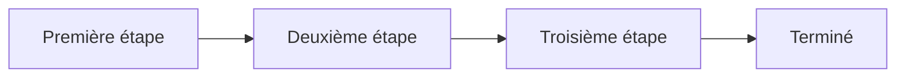

# Nom du flux

_Une phrase : ce qui entre, ce qui sort._

## Diagramme

## Étapes

1. **Première étape** : _qui s’en charge, et ce qu’il transmet._
2. **Deuxième étape** : _…_
3. **Troisième étape** : _…_
4. **Terminé** : _ce que « terminé » veut dire ici._
