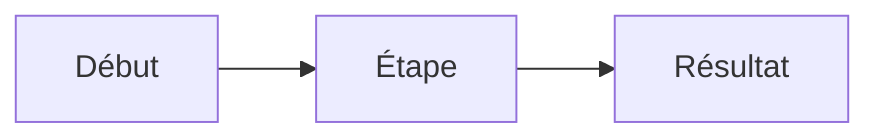

# Spécification : nom de la fonctionnalité

Statut : brouillon · Responsable : nom · Mise à jour : date

## Problème

_Ce qui ne va pas aujourd’hui, pour qui, et comment on le sait._

## Objectifs

- _Ce qui sera vrai une fois livré._

## Hors périmètre

- _Ce que cela ne fait pas, délibérément._

## Exigences

| ID | Exigence | Priorité |
|----|----------|----------|
| R1 | _Exigence_ | Indispensable |
| R2 | _Exigence_ | Souhaitable |

## Flux

## Critères d’acceptation

- [ ] R1 : _Comment on le vérifie._
- [ ] R2 : _Comment on le vérifie._

## Questions ouvertes

- _Question._
