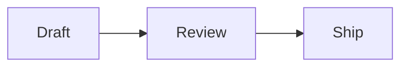

# コマンドラインで、Mac 上の Markdown を PDF に変換する。

無料の `marsdawn` ツールは、コマンド一つで Markdown ファイルを PDF に変換します。表、数式、Mermaid 図、ハイライトされたコードも、ソースで読めるとおりに出力され、MarsDawn アプリを含め、他に何もインストールする必要はありません。

## インストールする

```
brew install redtear1115/tap/marsdawn
marsdawn --version
```

Apple シリコンの Mac では、Homebrew が数秒でビルド済みのコピーをインストールします。Intel Mac では代わりにソースからビルドするため数分かかり、Xcode 26 以降が必要です。macOS 15 以降で動作し、`marsdawn --version` でインストールされたバージョンが表示されます。

## 文書を保存する

`plan.md` という名前のファイルに、次の内容を貼り付けてください：

````
# Plan: faster exports

An agent wrote this plan. You review it, then turn it into a PDF.

## Steps

| Step | Owner | Status |
|------|-------|--------|
| Measure the slow pages | Agent | Done |
| Cache rendered diagrams | Agent | In review |

The target is $t < 2\,\text{s}$ for a 50-page document:

$$
t_{\text{total}} = \sum_{i=1}^{n} t_i
$$



```swift
let pdf = try export("plan.md")
```
````

## 書き出す

```
marsdawn export plan.md
```

ソースの隣に `plan.pdf` を書き出し、保存先を表示します：

```
Exported /Users/you/plan.pdf (1 page)
```

これは実際に `marsdawn` 0.5.0 を実行して得られたそのページです：


## テーマ、紙のサイズ、ファイル名を選ぶ

```
marsdawn export plan.md --theme classic --paper letter -o handout.pdf
```

- `--theme`：dawn、classic、modern、vivid のいずれか、テーマのライトカラーを使います。指定しない場合、`export` はまず `$MARSDAWN_THEME` を、それもなければ dawn を使います。
- `--paper`：a4 または letter。デフォルトは a4 です。
- `-o`：PDF の書き出し先。指定しなければソースの隣に書き出されます。
- `--allow-remote-images`：書き出し中にウェブから画像を読み込みます。指定しない限りオフのままです。

## うまくいかないとき

- `A full installation of Xcode.app 26.0 is required to compile this software.` Homebrew が `marsdawn` をソースからビルドしています。Intel Mac ではこうなります。App Store から Xcode 26 以降をインストールし、もう一度インストールし直してください。
- `marsdawn: No such file: …` パスがファイルを指していません。名前を確認するか、ファイルがあるフォルダでコマンドを実行してください。
- `… already exists. Pass --force to replace it.` 同じ名前の PDF がすでにあります。`--force` を付けて上書きするか、`-o` で別の場所に書き出してください。
- `Error: The value '…' is invalid for '--theme <theme>'.` テーマまたは紙のサイズが認識されていません。テーマは dawn、classic、modern、vivid、紙は a4 または letter です。

## 次に

- すべてのオプションと出力される JSON：[コマンドライン](/ja/cli/)。
- コーディングエージェントにこれをやらせるには：[marsdawn の agent skill](/ja/cli/skill/)。
- 4つのプレビューテーマすべてと、PDF 書き出しの今後：[プレビューテーマと PDF 書き出し](/ja/themes/)。
- Markdown を使わない人に PDF を渡す：[PDF を共有する](/ja/sharing-exported-pdfs/)。

## その他

- [MarsDawn](https://marsdawn.southern-light.dev/ja/index.md): リアルタイムプレビュー、Mermaid 図、PDF 書き出しを備えたネイティブの Mac 向け Markdown エディタ。AI エージェントが書いた文章を読むために作られました。Mac App Store に近日公開予定。
- [あなたの文章は Mac に残ります](https://marsdawn.southern-light.dev/ja/yours/index.md): MarsDawn にはアカウントも同期もクラウドもありません。あなたの Markdown 文書は、選んだファイルとフォルダの中で、あなたの Mac に留まります。
- [無料で試して、一度だけ購入](https://marsdawn.southern-light.dev/ja/pay-once/index.md): MarsDawn は無料でダウンロードできます。14 日間すべての機能を試したあとは、USD 4.99 を一度だけ支払えば使い続けられます。サブスクリプションもアカウントも不要です。
- [PDF 書き出し](https://marsdawn.southern-light.dev/ja/pdf/index.md): Mac 上で Markdown を PDF に書き出す、または印刷する。Mermaid 図とハイライトされたコードも含まれます。改ページは短いコードブロックや表を分断しません。
- [Mac アプリ](https://marsdawn.southern-light.dev/ja/native/index.md): 本物の Mac アプリとしての Markdown エディタ：ネイティブのウインドウとタブ、自動保存、バージョン履歴、Finder のクイックルック、Mac らしく動くテキストエディタ。
- [MarsDawn ができないこと](https://marsdawn.southern-light.dev/ja/limits/index.md): 同期なし、iPhone・iPad アプリなし、プラグインなし、アカウント不要。内蔵テーマは4種類。購入前に知っておきたいこと。
- [サポート](https://marsdawn.southern-light.dev/ja/support/index.md): macOS 向け Markdown エディタ MarsDawn のヘルプ。
- [プライバシーポリシー](https://marsdawn.southern-light.dev/ja/privacy/index.md): MarsDawn は個人データを収集しません。文書と設定はあなたの Mac 上に残ります。
- [Mac で Markdown を見る](https://marsdawn.southern-light.dev/ja/view-markdown-on-mac/index.md): .md ファイルは、整形用の記号が入ったプレーンテキストです。Mac 上でレンダリングされた見た目を読む方法：今すぐ使える無料の marsdawn コマンドラインツールで PDF にする方法と、Mac App Store に近日公開予定の MarsDawn アプリで読む方法。
- [MacMD Viewer と MarsDawn](https://marsdawn.southern-light.dev/ja/vs/macmd-viewer/index.md): MacMD Viewer は Markdown を読み取り専用で表示、USD 19.99。MarsDawn は編集とプレビューを並べて表示、Mac App Store で無料お試し後に USD 4.99 を一度だけ。
- [コマンドライン](https://marsdawn.southern-light.dev/ja/cli/index.md): Mac 向けの無料コマンドラインツール marsdawn：シェルやスクリプト、LLM エージェントから Markdown を PDF に書き出せます。JSON 出力にも対応。Homebrew でインストールできます。
- [AI エージェント向け marsdawn](https://marsdawn.southern-light.dev/ja/cli/agents/index.md): Markdown を PDF に変換するために marsdawn を呼び出す AI エージェントやスクリプトのためのリファレンス：コマンド、JSON 出力、スキーマ、終了コード、動作要件。
- [エージェント用スキル](https://marsdawn.southern-light.dev/ja/cli/skill/index.md): コーディングエージェントが読み込む1つのファイルで、marsdawn をインストールし、動作を確認し、Markdown を PDF に書き出し、JSON 結果を読み取れるようにします。
- [MCP サーバー](https://marsdawn.southern-light.dev/ja/cli/mcp/index.md): marsdawn には自前の AI モデルがないので、どのエージェントが書いた Markdown かは関係ありません。CLI、skill ファイル、marsdawn-mcp という MCP サーバーのいずれからでも呼び出せ、三つとも同じ export を実行します。
- [トークンを使わないレビュー](https://marsdawn.southern-light.dev/ja/token-efficient-review/index.md): 人が MarsDawn でレンダリングされたページを読みます。それがエージェントの context に読み戻されることはありません。ツール呼び出し自体も、レンダリングされた内容ではなく精簡な JSON 結果を返すので、呼び出し自体も安上がりです。
- [他のツールで Markdown を見る場合との比較](https://marsdawn.southern-light.dev/ja/vs/markdown-preview-tools/index.md): VS Code の内蔵プレビュー、ブラウザ拡張機能、Claude Desktop のファイルプレビューで Markdown を読む場合と、MarsDawn を比較：それぞれが実際にレンダリングするもの、1つのファイルを開くのにかかる手間。
- [プレビューテーマと PDF 書き出し](https://marsdawn.southern-light.dev/ja/themes/index.md): それぞれライトとダークを持つ4種類のプレビューテーマと、今見ているテーマに合わせた1つの PDF・印刷書き出し。もっと多くの輸入可能なテーマと、自分のテーマを共有できるギャラリーも計画されています。
- [書き出した PDF を共有する](https://marsdawn.southern-light.dev/ja/sharing-exported-pdfs/index.md): エージェントの書いた Markdown を PDF に書き出し、Markdown を読まず何もインストールしない同僚に渡します。構文もアプリもアカウントも、開くのに一切不要です。
- [AI の出力を人が確認する理由](https://marsdawn.southern-light.dev/ja/reviewing-ai-output/index.md): AI が書いた Markdown も、結局は人が理解しなければなりません。読みやすいからといって鵜呑みにはできません。MarsDawn はレンダリングされたページとソースを並べ、Mermaid 図と KaTeX 数式を描画するので、構造が一目で分かります。
- [English](https://marsdawn.southern-light.dev/markdown-to-pdf/index.md): Convert Markdown to PDF on a Mac with the free marsdawn command-line tool. Install it with Homebrew and run one command: tables, math, Mermaid and code.
- [繁體中文](https://marsdawn.southern-light.dev/zh-hant/markdown-to-pdf/index.md): 免費的 Markdown 轉 PDF 工具：在 Mac 上用 marsdawn 命令列，一個指令就把 Markdown 轉成 PDF，表格、數學式、Mermaid 圖表和程式碼上色都在。
- [简体中文](https://marsdawn.southern-light.dev/zh-hans/markdown-to-pdf/index.md): 免费的 Markdown 转 PDF 工具：在 Mac 上用 marsdawn 命令行，一个命令就把 Markdown 转成 PDF，表格、数学式、Mermaid 图表和代码上色都在。
