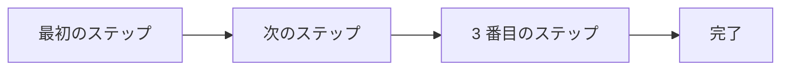

# フロー名

_一文で：何が入り、何が出るか。_

## 図

```mermaid
flowchart LR
  A[最初のステップ] --> B[次のステップ]
  B --> C[3 番目のステップ]
  C --> D[完了]
```

## ステップ

1. **最初のステップ**：_誰がやり、次に何を渡すか。_
2. **次のステップ**：_……_
3. **3 番目のステップ**：_……_
4. **完了**：_ここでの「完了」の意味。_
