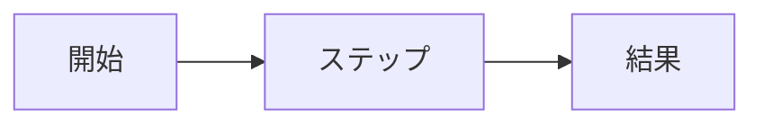

# 仕様：機能名

ステータス：下書き · 担当：名前 · 更新：日付

## 課題

_いま何が問題で、誰が困っていて、なぜそうとわかるか。_

## 目標

- _リリース後に成り立っていること。_

## やらないこと

- _今回あえてやらないこと。_

## 要件

| ID | 要件 | 優先度 |
|----|------|--------|
| R1 | _要件_ | 必須 |
| R2 | _要件_ | 推奨 |

## フロー

## 受け入れ基準

- [ ] R1：_どう確かめるか。_
- [ ] R2：_どう確かめるか。_

## 未決事項

- _問い。_
