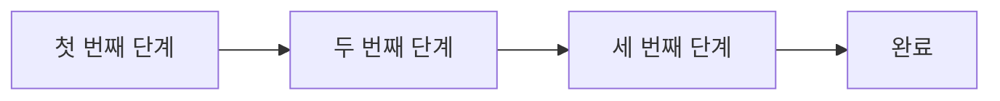

# 흐름 이름

_한 문장으로: 무엇이 들어가고 무엇이 나오는지._

## 다이어그램

```mermaid
flowchart LR
  A[첫 번째 단계] --> B[두 번째 단계]
  B --> C[세 번째 단계]
  C --> D[완료]
```

## 단계

1. **첫 번째 단계:** _누가 맡고, 다음 단계에 무엇을 넘기는지._
2. **두 번째 단계:** _…_
3. **세 번째 단계:** _…_
4. **완료:** _여기서 ‘완료’가 무슨 뜻인지._
