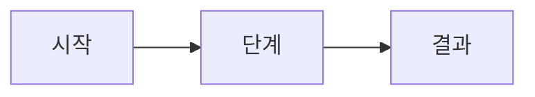

# 명세: 기능 이름

상태: 초안 · 담당: 이름 · 업데이트: 날짜

## 문제

_지금 무엇이 문제인지, 누구에게 문제인지, 어떻게 알게 됐는지._

## 목표

- _출시되면 달라져 있을 것._

## 하지 않을 것

- _이번에 일부러 하지 않는 것._

## 요구 사항

| ID | 요구 사항 | 우선순위 |
|----|-----------|----------|
| R1 | _요구 사항_ | 필수 |
| R2 | _요구 사항_ | 권장 |

## 흐름

## 인수 기준

- [ ] R1: _확인 방법._
- [ ] R2: _확인 방법._

## 미결 질문

- _질문._
