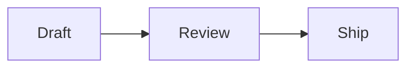

# Markdown to PDF on a Mac, from the command line.

The free `marsdawn` tool turns a Markdown file into a PDF with one command. Tables, math, Mermaid diagrams and highlighted code come out the way they read in the source, and it needs nothing else installed, not even the MarsDawn app.

## Install it

```
brew install redtear1115/tap/marsdawn
marsdawn --version
```

On an Apple silicon Mac, Homebrew installs a prebuilt copy in seconds. On an Intel Mac it builds from source instead, which takes a few minutes and needs Xcode 26 or later. It runs on macOS 15 or later, and `marsdawn --version` prints the version you got.

## Save a document

Paste this into a file named `plan.md`:

````
# Plan: faster exports

An agent wrote this plan. You review it, then turn it into a PDF.

## Steps

| Step | Owner | Status |
|------|-------|--------|
| Measure the slow pages | Agent | Done |
| Cache rendered diagrams | Agent | In review |

The target is $t < 2\,\text{s}$ for a 50-page document:

$$
t_{\text{total}} = \sum_{i=1}^{n} t_i
$$



```swift
let pdf = try export("plan.md")
```
````

## Export it

```
marsdawn export plan.md
```

It writes `plan.pdf` next to the source and prints where it went:

```
Exported /Users/you/plan.pdf (1 page)
```

This is that page, captured from a real run of `marsdawn` 0.5.0:


## Choose a theme, paper size and file name

```
marsdawn export plan.md --theme classic --paper letter -o handout.pdf
```

- `--theme`: dawn, classic, modern or vivid, in the theme's light colors. Without it, `export` uses `$MARSDAWN_THEME`, then dawn.
- `--paper`: a4 or letter. The default is a4.
- `-o`: where to write the PDF, instead of next to the source.
- `--allow-remote-images`: load images from the web while rendering. They stay off unless you pass it.

## If it doesn't work

- `A full installation of Xcode.app 26.0 is required to compile this software.` Homebrew is building `marsdawn` from source, as it does on an Intel Mac. Install Xcode 26 or later from the App Store, then run the install again.
- `marsdawn: No such file: …` The path doesn't point at a file. Check the name, or run the command from the folder the file is in.
- `… already exists. Pass --force to replace it.` A PDF with that name is already there. Add `--force` to replace it, or `-o` to write it somewhere else.
- `Error: The value '…' is invalid for '--theme <theme>'.` The theme or paper size isn't one it knows. The themes are dawn, classic, modern and vivid; the paper is a4 or letter.

## Next

- Every option and the JSON it prints: [Command Line](/cli/).
- To have a coding agent do this for you: [the marsdawn agent skill](/cli/skill/).

## More

- [MarsDawn](https://marsdawn.southern-light.dev/index.md): A native Mac Markdown editor with live preview, Mermaid diagrams and PDF export, built for reading what AI agents write. Coming soon to the Mac App Store.
- [Your writing stays on your Mac](https://marsdawn.southern-light.dev/yours/index.md): MarsDawn has no account, no sync and no cloud. Your Markdown documents stay on your Mac, in the files and folders you choose.
- [Try free, pay once](https://marsdawn.southern-light.dev/pay-once/index.md): MarsDawn is free to download. Try everything for 14 days, then unlock it once for USD 4.99. No subscription, no account.
- [PDF export](https://marsdawn.southern-light.dev/pdf/index.md): Export Markdown as a PDF or print it on your Mac, with Mermaid diagrams and highlighted code. Page breaks avoid splitting short code blocks and tables.
- [A Mac app](https://marsdawn.southern-light.dev/native/index.md): A Markdown editor that is a real Mac app: native windows and tabs, autosave, version history, Quick Look in Finder and a text editor that behaves like a Mac.
- [What MarsDawn doesn't do](https://marsdawn.southern-light.dev/limits/index.md): No sync, no iPhone or iPad app, no plugins, no accounts. Four built-in themes. Know before you buy.
- [Support](https://marsdawn.southern-light.dev/support/index.md): Get help with MarsDawn, the Markdown editor for macOS.
- [Privacy Policy](https://marsdawn.southern-light.dev/privacy/index.md): MarsDawn does not collect personal data. Your documents and settings stay on your Mac.
- [View Markdown on a Mac](https://marsdawn.southern-light.dev/view-markdown-on-mac/index.md): A .md file is plain text with formatting marks in it. Here is how to read it rendered on a Mac: as a PDF with the free marsdawn command-line tool today, and in the MarsDawn app, coming soon to the Mac App Store.
- [MacMD Viewer vs. MarsDawn](https://marsdawn.southern-light.dev/vs/macmd-viewer/index.md): MacMD Viewer renders Markdown read-only for USD 19.99. MarsDawn edits and previews side by side, free to try then USD 4.99 once on the Mac App Store.
- [Command Line](https://marsdawn.southern-light.dev/cli/index.md): The free marsdawn command-line tool for Mac: export Markdown to PDF from a shell, a script or an LLM agent, with JSON output. Install it with Homebrew.
- [marsdawn for agents](https://marsdawn.southern-light.dev/cli/agents/index.md): A reference for AI agents and scripts that call marsdawn to turn Markdown into PDF: commands, JSON output, schemas, exit codes and requirements.
- [Agent skill](https://marsdawn.southern-light.dev/cli/skill/index.md): One file your coding agent loads to install marsdawn, check it works, export Markdown to PDF and read the JSON result.
- [繁體中文](https://marsdawn.southern-light.dev/zh-hant/markdown-to-pdf/index.md): 免費的 Markdown 轉 PDF 工具：在 Mac 上用 marsdawn 命令列，一個指令就把 Markdown 轉成 PDF，表格、數學式、Mermaid 圖表和程式碼上色都在。
