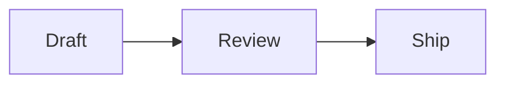

# Markdown to PDF, from the command line.

The free `marsdawn` tool turns a Markdown file into a PDF with one command. Tables, math, Mermaid diagrams and highlighted code come out the way they read in the source, and it needs nothing else installed, not even the MarsDawn app.

## Install it

```
brew install redtear1115/tap/marsdawn
marsdawn --version
```

On an Apple silicon Mac, Homebrew installs a prebuilt copy in seconds. On an Intel Mac it builds from source instead, which takes a few minutes and needs Xcode 26 or later. It runs on macOS 15 or later, and `marsdawn --version` prints the version you got.

## Save a document

Paste this into a file named `plan.md`:

````
# Plan: faster exports

An agent wrote this plan. You review it, then turn it into a PDF.

## Steps

| Step | Owner | Status |
|------|-------|--------|
| Measure the slow pages | Agent | Done |
| Cache rendered diagrams | Agent | In review |

The target is $t < 2\,\text{s}$ for a 50-page document:

$$
t_{\text{total}} = \sum_{i=1}^{n} t_i
$$



```swift
let pdf = try export("plan.md")
```
````

## Export it

```
marsdawn export plan.md
```

It writes `plan.pdf` next to the source and prints where it went:

```
Exported /Users/you/plan.pdf (1 page)
```

This is that page, captured from a real run of `marsdawn` 0.5.0:


## If it doesn't work

- `A full installation of Xcode.app 26.0 is required to compile this software.` Homebrew is building `marsdawn` from source, as it does on an Intel Mac. Install Xcode 26 or later from the App Store, then run the install again.
- `marsdawn: No such file: …` The path doesn't point at a file. Check the name, or run the command from the folder the file is in.
- `… already exists. Pass --force to replace it.` A PDF with that name is already there. Add `--force` to replace it, or `-o` to write it somewhere else.
- `Error: The value '…' is invalid for '--theme <theme>'.` The theme or paper size isn't one it knows. The themes are dawn, classic, modern and vivid; the paper is a4 or letter.

## Next

- Every option and the JSON it prints: [Command Line](/cli/).
- To have a coding agent do this for you: [the marsdawn agent skill](/cli/skill/).

## More

- [MarsDawn](https://marsdawn.southern-light.dev/index.md): MarsDawn: a native Mac Markdown editor built for the AI workflow. An agent writes the Markdown, you review it with live preview, and it revises.
- [Your writing stays on your Mac](https://marsdawn.southern-light.dev/yours/index.md): MarsDawn has no account, no sync and no cloud. Your documents stay on your Mac.
- [Pay once](https://marsdawn.southern-light.dev/pay-once/index.md): MarsDawn costs USD 4.99, once. No subscription, no account, no paid tier.
- [PDF export](https://marsdawn.southern-light.dev/pdf/index.md): Export as PDF or print, with Mermaid diagrams, highlighted code and careful page breaks.
- [A Mac app](https://marsdawn.southern-light.dev/native/index.md): Native windows and tabs, autosave, version history, Quick Look, and a text editor that behaves like the rest of your Mac.
- [What MarsDawn doesn't do](https://marsdawn.southern-light.dev/limits/index.md): No sync, no iPhone or iPad app, no plugins, no accounts. Four built-in themes. Know before you buy.
- [Support](https://marsdawn.southern-light.dev/support/index.md): Get help with MarsDawn, the Markdown editor for macOS.
- [Privacy Policy](https://marsdawn.southern-light.dev/privacy/index.md): MarsDawn does not collect personal data. Your documents and settings stay on your Mac.
- [Command Line](https://marsdawn.southern-light.dev/cli/index.md): The free marsdawn command-line tool: export Markdown to PDF from a shell or an LLM agent, and, with the MarsDawn app installed, open files in it.
- [marsdawn for agents](https://marsdawn.southern-light.dev/cli/agents/index.md): A reference for AI agents and scripts that call marsdawn: commands, JSON output, schemas, exit codes and requirements.
- [Agent skill](https://marsdawn.southern-light.dev/cli/skill/index.md): One file your coding agent loads to install marsdawn, check it works, export Markdown to PDF and read the JSON result.
- [繁體中文](https://marsdawn.southern-light.dev/zh-hant/markdown-to-pdf/index.md): 用免費的 marsdawn 命令列工具，把 Markdown 檔案轉成 PDF。用 Homebrew 安裝，執行一個指令，表格、數學式、Mermaid 圖表和程式碼上色都會出現在頁面上。
