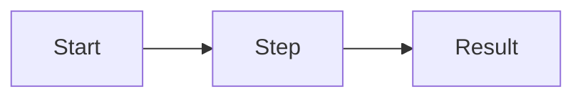

# Spec: Feature name

Status: draft · Owner: name · Updated: date

## Problem

_What is wrong today, for whom, and how we know._

## Goals

- _What will be true when this ships._

## Non-goals

- _What this deliberately doesn't do._

## Requirements

| ID | Requirement | Priority |
|----|-------------|----------|
| R1 | _Requirement_ | Must |
| R2 | _Requirement_ | Should |

## Flow

## Acceptance criteria

- [ ] R1: _How we check it._
- [ ] R2: _How we check it._

## Open questions

- _Question._
