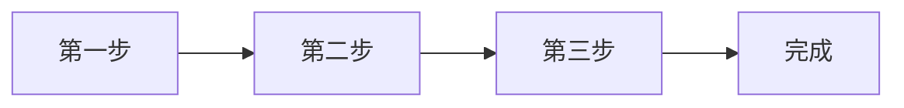

# 流程名称

_一句话：输入什么，产出什么。_

## 图

```mermaid
flowchart LR
  A[第一步] --> B[第二步]
  B --> C[第三步]
  C --> D[完成]
```

## 步骤

1. **第一步**：_谁来做，交给下一步什么。_
2. **第二步**：_……_
3. **第三步**：_……_
4. **完成**：_这里的“完成”是什么意思。_
