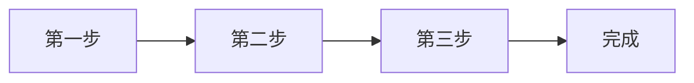

# Markdown 流程图模板

一张 Mermaid 流程图，下方把每个步骤写清楚，图和文字可以互相对照。去掉一个步骤，再请 agent 把其他部分改好。

## 模板

[下载 flowchart.md](/zh-hans/templates/flowchart/flowchart.md)

````
# 流程名称

_一句话：输入什么，产出什么。_

## 图



## 步骤

1. **第一步**：_谁来做，交给下一步什么。_
2. **第二步**：_……_
3. **第三步**：_……_
4. **完成**：_这里的“完成”是什么意思。_
````

## 导出效果


用 `marsdawn export flowchart.md` 输出。免费的命令行工具排版和 MarsDawn 的预览一样，图表也一起画出来。

## 交给 agent

```
用 https://marsdawn.southern-light.dev/zh-hans/templates/flowchart/flowchart.md 这份模板，把［流程］画进 flowchart.md。每个节点对应一个编号步骤，顺序相同。写好之后运行 marsdawn open flowchart.md。
```

## 输出 PDF 分享

`marsdawn export flowchart.md`：流程图会画进 PDF 里。

## 做不到的事

MarsDawn 按 Mermaid 写的内容画图，不能手动排版，也不会让编号步骤和节点保持一致。Mermaid 有错误时，预览会显示错误信息，而不是图。

## 常见问题

### 哪些图可以用？

Mermaid 画得出来的都可以：流程图、时序图、状态图等等。

### 为什么还要把步骤写出来？

快速浏览的人看图；要仔细确认的人需要文字。agent 可以让两者保持一致。

## 其他模板

- [规格文档（PRD）](/zh-hans/templates/spec/)：问题、目标、需求、流程图和验收标准。
- [会议记录](/zh-hans/templates/meeting-notes/)：决议和行动项，每项都有负责人。
- [Markdown 模板](/zh-hans/templates/)

## 其他页面

- [MarsDawn](https://marsdawn.southern-light.dev/zh-hans/index.md): 给要掌舵 agentic 开发的人用的 Markdown：原生的 Mac 编辑器，有实时预览、Mermaid 图表和 PDF 输出。即将在 Mac App Store 上架。
- [你写的内容留在你的 Mac 上](https://marsdawn.southern-light.dev/zh-hans/yours/index.md): MarsDawn 不需要账户，没有同步，也没有云端。你的 Markdown 文稿留在你的 Mac 上，就在你选的文件和文件夹里。
- [免费试用，买一次就好](https://marsdawn.southern-light.dev/zh-hans/pay-once/index.md): MarsDawn 免费下载。先免费试用 14 天，之后花 USD 4.99 解锁一次就好。没有订阅，也不需要账户。
- [输出 PDF](https://marsdawn.southern-light.dev/zh-hans/pdf/index.md): 在 Mac 上把 Markdown 输出成 PDF 或打印，Mermaid 图表和代码高亮都会保留；分页会尽量不切开短的代码和表格，超过一页的会接到下一页。
- [为 Mac 而做](https://marsdawn.southern-light.dev/zh-hans/native/index.md): 真正的 Mac app：原生窗口与标签页、自动保存、版本记录、在访达用快速查看预览 Markdown，文本编辑器的操作和 Mac 上其他 app 一致。
- [MarsDawn 做不到的事](https://marsdawn.southern-light.dev/zh-hans/limits/index.md): 没有同步、没有 iPhone 或 iPad 版、没有插件、不需要账户，内置四种主题。购买前先知道。
- [支持](https://marsdawn.southern-light.dev/zh-hans/support/index.md): MarsDawn（macOS Markdown 编辑器）的使用说明与联系方式。
- [隐私政策](https://marsdawn.southern-light.dev/zh-hans/privacy/index.md): MarsDawn 不收集任何个人数据，你的文稿与设置都留在你的 Mac 上。
- [在 Mac 上看 Markdown](https://marsdawn.southern-light.dev/zh-hans/view-markdown-on-mac/index.md): md 文件是加上格式记号的纯文本。这页说明怎么在 Mac 上看到排版后的样子：现在可以用免费的 marsdawn 命令行工具转成 PDF，之后可以用即将在 Mac App Store 上架的 MarsDawn app。
- [Markdown 转 PDF](https://marsdawn.southern-light.dev/zh-hans/markdown-to-pdf/index.md): 免费的 Markdown 转 PDF 工具：在 Mac 上用 marsdawn 命令行，一个命令就把 Markdown 转成 PDF，表格、数学公式、Mermaid 图表和代码高亮都在。
- [MacMD Viewer 对比 MarsDawn](https://marsdawn.southern-light.dev/zh-hans/vs/macmd-viewer/index.md): MacMD Viewer 是只读查看器，直接购买 USD 19.99。MarsDawn 边编辑边预览，免费试用后在 Mac App Store 一次解锁 USD 4.99。逐项比较功能、价格和购买方式。
- [命令行工具](https://marsdawn.southern-light.dev/zh-hans/cli/index.md): 免费的 marsdawn 命令行工具：在 Mac 上从终端、脚本或 LLM agent 把 Markdown 导出成 PDF，并提供 JSON 输出。用 Homebrew 安装。
- [给 AI agent 的 marsdawn 参考](https://marsdawn.southern-light.dev/zh-hans/cli/agents/index.md): 给调用 marsdawn 把 Markdown 转成 PDF 的 AI agent 与脚本的参考：命令、JSON 输出、Schema、退出代码与系统需求。
- [给 agent 的 skill](https://marsdawn.southern-light.dev/zh-hans/cli/skill/index.md): 一个文件，让写程序的 agent 学会安装 marsdawn、确认它能用、把 Markdown 导出成 PDF，并读懂 JSON 结果。
- [MCP 服务器](https://marsdawn.southern-light.dev/zh-hans/cli/mcp/index.md): marsdawn 没有自己的 AI 模型，是哪个 agent 写出 Markdown 都无所谓。可以从 CLI、skill 文件，或 marsdawn-mcp 这个 MCP 服务器调用，三者最后都运行同一个 export。
- [节省 token 的审阅方式](https://marsdawn.southern-light.dev/zh-hans/token-efficient-review/index.md): 人在 MarsDawn 里读排版后的页面，不会被读回 agent 的 context。工具调用本身返回的也只是精简的 JSON，不是排版内容，调用本身就很便宜。
- [在别处看 Markdown，对比 MarsDawn](https://marsdawn.southern-light.dev/zh-hans/vs/markdown-preview-tools/index.md): MarsDawn 对比在 VS Code 内置预览、浏览器扩展，或 Claude Desktop 文件预览里看 Markdown：各自能排版出什么，打开一个文件要花多少功夫。
- [预览主题与 PDF 导出](https://marsdawn.southern-light.dev/zh-hans/themes/index.md): 四种主题，各有浅色与深色，一套导出对应你正在看的主题。更多可导入的主题，和让大家投稿主题的主题库，都在规划中。
- [分享导出的 PDF](https://marsdawn.southern-light.dev/zh-hans/sharing-exported-pdfs/index.md): 把 agent 写的 Markdown 导出成 PDF，交给不写 Markdown、也不会安装任何东西的同事。不用懂语法，不用装 app，也不需要账号就能打开。
- [为什么 AI 写的东西还是需要人读过](https://marsdawn.southern-light.dev/zh-hans/reviewing-ai-output/index.md): AI 写的 Markdown 还是得由人来理解，不能因为读起来通顺就直接相信。MarsDawn 把排版后的页面和源代码并排，也把 Mermaid 图表与 KaTeX 数学式画出来，让结构一眼就看得懂。
- [更新记录](https://marsdawn.southern-light.dev/zh-hans/changelog/index.md): 免费的 marsdawn 命令行工具改了什么。
- [模板](https://marsdawn.southern-light.dev/zh-hans/templates/index.md): 给 agent 写、你来读的文档用的 Markdown 模板：规格文档、流程图和会议记录，每份都附一段给 agent 的提示词。
- [规格文档模板](https://marsdawn.southern-light.dev/zh-hans/templates/spec/index.md): Markdown 规格文档模板，包含需求、Mermaid 流程图和验收标准。agent 来填，你在 MarsDawn 里审阅。
- [会议记录模板](https://marsdawn.southern-light.dev/zh-hans/templates/meeting-notes/index.md): Markdown 会议记录模板，列出决议和行动项，每项都有负责人。agent 来写，你在 MarsDawn 里确认。
- [English](https://marsdawn.southern-light.dev/templates/flowchart/index.md): A Mermaid flowchart template in Markdown, with the steps written out below it. Preview it on a Mac and export it to PDF.
- [繁體中文](https://marsdawn.southern-light.dev/zh-hant/templates/flowchart/index.md): Markdown 的 Mermaid 流程圖範本，圖的下方把步驟寫出來。在 Mac 上預覽，也能輸出成 PDF。
- [日本語](https://marsdawn.southern-light.dev/ja/templates/flowchart/index.md): Markdown で書く Mermaid フローチャートのテンプレート。図の下に各ステップを書き出します。Mac でプレビューし、PDF に書き出せます。
