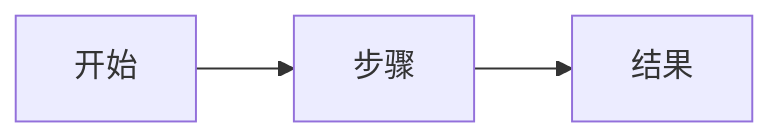

# 规格：功能名称

状态：草稿 · 负责人：姓名 · 更新：日期

## 问题

_现在哪里有问题、影响谁、我们怎么知道。_

## 目标

- _上线后会成立的事。_

## 不做的事

- _这次刻意不做的事。_

## 需求

| 编号 | 需求 | 优先级 |
|------|------|--------|
| R1 | _需求_ | 必须 |
| R2 | _需求_ | 应该 |

## 流程

## 验收标准

- [ ] R1：_怎么确认。_
- [ ] R2：_怎么确认。_

## 待定问题

- _问题。_
