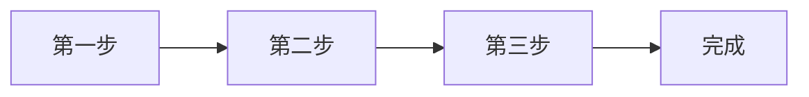

# 流程名稱

_一句話：輸入什麼，產出什麼。_

## 圖

```mermaid
flowchart LR
  A[第一步] --> B[第二步]
  B --> C[第三步]
  C --> D[完成]
```

## 步驟

1. **第一步**：_誰來做，交給下一步什麼。_
2. **第二步**：_……_
3. **第三步**：_……_
4. **完成**：_這裡的「完成」是什麼意思。_
