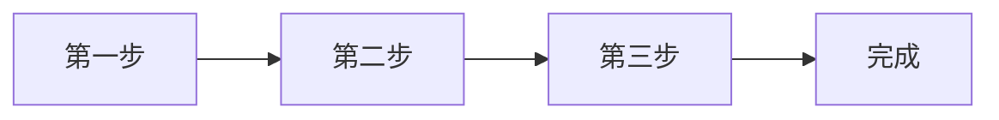

# Markdown 流程圖範本

一張 Mermaid 流程圖，下方把每個步驟寫清楚，圖和文字可以互相對照。拿掉一個步驟，再請 agent 把其他部分改好。

## 範本

[下載 flowchart.md](/zh-hant/templates/flowchart/flowchart.md)

````
# 流程名稱

_一句話：輸入什麼，產出什麼。_

## 圖



## 步驟

1. **第一步**：_誰來做，交給下一步什麼。_
2. **第二步**：_……_
3. **第三步**：_……_
4. **完成**：_這裡的「完成」是什麼意思。_
````

## 長什麼樣子


用 `marsdawn export flowchart.md` 輸出。免費的命令列工具排版和 MarsDawn 的預覽一樣，圖表也一起畫出來。

## 交給 agent

```
用 https://marsdawn.southern-light.dev/zh-hant/templates/flowchart/flowchart.md 這份範本，把［流程］畫進 flowchart.md。每個節點對應一個編號步驟，順序相同。寫好之後執行 marsdawn open flowchart.md。
```

## 輸出 PDF 分享

`marsdawn export flowchart.md`：流程圖會畫進 PDF 裡。

## 做不到的事

MarsDawn 照 Mermaid 寫的內容畫圖，不能手動排版，也不會讓編號步驟和節點保持一致。Mermaid 有錯的話，預覽會顯示錯誤訊息，而不是圖。

## 常見問題

### 哪些圖可以用？

Mermaid 畫得出來的都可以：流程圖、循序圖、狀態圖等等。

### 為什麼還要把步驟寫出來？

快速瀏覽的人看圖；要仔細確認的人需要文字。agent 可以讓兩者保持一致。

## 其他範本

- [規格文件（PRD）](/zh-hant/templates/spec/)：問題、目標、需求、流程圖和驗收條件。
- [會議記錄](/zh-hant/templates/meeting-notes/)：決議和行動項目，每項都有負責人。
- [Markdown 範本](/zh-hant/templates/)

## 其他頁面

- [MarsDawn](https://marsdawn.southern-light.dev/zh-hant/index.md): 給要掌舵 agentic 開發的人用的 Markdown：原生的 Mac 編輯器，有即時預覽、Mermaid 圖表和 PDF 輸出。即將在 Mac App Store 上架。
- [你寫的內容留在你的 Mac 上](https://marsdawn.southern-light.dev/zh-hant/yours/index.md): MarsDawn 不需要帳號，沒有同步，也沒有雲端。你的 Markdown 文件留在你的 Mac 上，就在你選的檔案和資料夾裡。
- [免費試用，買一次就好](https://marsdawn.southern-light.dev/zh-hant/pay-once/index.md): MarsDawn 免費下載。先免費試用 14 天，之後花 USD 4.99 解鎖一次就好。沒有訂閱，也不需要帳號。
- [輸出 PDF](https://marsdawn.southern-light.dev/zh-hant/pdf/index.md): 在 Mac 上把 Markdown 輸出成 PDF 或列印，Mermaid 圖表和程式碼上色都會保留；分頁會盡量不切開短的程式碼和表格，超過一頁的會接到下一頁。
- [為 Mac 而做](https://marsdawn.southern-light.dev/zh-hant/native/index.md): 真正的 Mac app：原生視窗與分頁、自動儲存、版本記錄、在 Finder 用快速查看預覽 Markdown，文字編輯器的操作和 Mac 上其他 app 一致。
- [MarsDawn 做不到的事](https://marsdawn.southern-light.dev/zh-hant/limits/index.md): 沒有同步、沒有 iPhone 或 iPad 版、沒有外掛、不需要帳號，內建四種主題。購買前先知道。
- [支援](https://marsdawn.southern-light.dev/zh-hant/support/index.md): MarsDawn（macOS Markdown 編輯器）的使用說明與聯絡方式。
- [隱私權政策](https://marsdawn.southern-light.dev/zh-hant/privacy/index.md): MarsDawn 不收集任何個人資料，你的文件與設定都留在你的 Mac 上。
- [在 Mac 上看 Markdown](https://marsdawn.southern-light.dev/zh-hant/view-markdown-on-mac/index.md): md 檔案是加上格式記號的純文字。這頁說明怎麼在 Mac 上看到排版後的樣子：現在可以用免費的 marsdawn 命令列工具轉成 PDF，之後可以用即將在 Mac App Store 上架的 MarsDawn app。
- [Markdown 轉 PDF](https://marsdawn.southern-light.dev/zh-hant/markdown-to-pdf/index.md): 免費的 Markdown 轉 PDF 工具：在 Mac 上用 marsdawn 命令列，一個指令就把 Markdown 轉成 PDF，表格、數學式、Mermaid 圖表和程式碼上色都在。
- [MacMD Viewer 對比 MarsDawn](https://marsdawn.southern-light.dev/zh-hant/vs/macmd-viewer/index.md): MacMD Viewer 是唯讀檢視器，直接購買 USD 19.99。MarsDawn 邊編輯邊預覽，免費試用後在 Mac App Store 一次解鎖 USD 4.99。逐項比較功能、價格和購買方式。
- [命令列工具](https://marsdawn.southern-light.dev/zh-hant/cli/index.md): 免費的 marsdawn 命令列工具：在 Mac 上從終端機、腳本或 LLM agent 把 Markdown 匯出成 PDF，並提供 JSON 輸出。用 Homebrew 安裝。
- [給 AI agent 的 marsdawn 參考](https://marsdawn.southern-light.dev/zh-hant/cli/agents/index.md): 給呼叫 marsdawn 把 Markdown 轉成 PDF 的 AI agent 與腳本的參考：指令、JSON 輸出、Schema、離開代碼與系統需求。
- [給 agent 的 skill](https://marsdawn.southern-light.dev/zh-hant/cli/skill/index.md): 一個檔案，讓寫程式的 agent 學會安裝 marsdawn、確認它能用、把 Markdown 匯出成 PDF，並讀懂 JSON 結果。
- [MCP 伺服器](https://marsdawn.southern-light.dev/zh-hant/cli/mcp/index.md): marsdawn 沒有自己的 AI 模型，是哪個 agent 寫出 Markdown 都無所謂。可以從 CLI、skill 檔案，或 marsdawn-mcp 這個 MCP 伺服器呼叫，三者最後都執行同一個 export。
- [節省 token 的審閱方式](https://marsdawn.southern-light.dev/zh-hant/token-efficient-review/index.md): 人在 MarsDawn 裡讀排版後的頁面，不會被讀回 agent 的 context。工具呼叫本身回傳的也只是精簡的 JSON，不是排版內容，呼叫本身就很便宜。
- [在別處看 Markdown，對比 MarsDawn](https://marsdawn.southern-light.dev/zh-hant/vs/markdown-preview-tools/index.md): MarsDawn 對比在 VS Code 內建預覽、瀏覽器擴充功能，或 Claude Desktop 檔案預覽裡看 Markdown：各自能排版出什麼，打開一個檔案要花多少功夫。
- [預覽主題與 PDF 輸出](https://marsdawn.southern-light.dev/zh-hant/themes/index.md): 四種主題，各有淺色與深色，一套輸出對應你正在看的主題。更多可匯入的主題，和讓大家投稿主題的主題庫，都在規劃中。
- [分享輸出的 PDF](https://marsdawn.southern-light.dev/zh-hant/sharing-exported-pdfs/index.md): 把 agent 寫的 Markdown 輸出成 PDF，交給不寫 Markdown、也不會安裝任何東西的同事。不用懂語法，不用裝 app，也不需要帳號就能打開。
- [為什麼 AI 寫的東西還是需要人讀過](https://marsdawn.southern-light.dev/zh-hant/reviewing-ai-output/index.md): AI 寫的 Markdown 還是得由人來理解，不能因為讀起來通順就直接相信。MarsDawn 把排版後的頁面和原始碼並排，也把 Mermaid 圖表與 KaTeX 數學式畫出來，讓結構一眼就看得懂。
- [讀懂 agent 交回來的 Markdown](https://marsdawn.southern-light.dev/zh-hant/reading-agent-output/index.md): AI agent 把工作成果交成 Markdown：計畫、規格、進度報告。做 agent 的人怎麼談檢查點和失敗、這些產出為什麼難讀，以及五分鐘審完一份計畫的檢查清單。
- [agent 的透明](https://marsdawn.southern-light.dev/zh-hant/agent-transparency/index.md): Anthropic 談打造 agent 的指南要求透明：把規劃步驟攤開來。它說了什麼、沒說什麼，以及為什麼這些步驟最後多半變成一份要有人讀的 Markdown。
- [審 agent 計畫](https://marsdawn.southern-light.dev/zh-hant/reviewing-agent-plans/index.md): agent 交出計畫、還沒開始執行之前，用六個步驟、大約五分鐘把它審完。什麼編輯器都能用，附一份實際的例子。
- [agent 設計模式](https://marsdawn.southern-light.dev/zh-hant/agent-design-patterns/index.md): Andrew Ng 提出的四種 agent 設計模式：reflection、tool use、planning、multi-agent collaboration，以及每一種通常會交回什麼要你讀的文件。
- [更新紀錄](https://marsdawn.southern-light.dev/zh-hant/changelog/index.md): 免費的 marsdawn 命令列工具改了什麼。
- [範本](https://marsdawn.southern-light.dev/zh-hant/templates/index.md): 給 agent 寫、你來讀的文件用的 Markdown 範本：規格文件、流程圖和會議記錄，每份都附一段給 agent 的提示詞。
- [規格文件範本](https://marsdawn.southern-light.dev/zh-hant/templates/spec/index.md): Markdown 規格文件範本，含需求、Mermaid 流程圖和驗收條件。agent 來填，你在 MarsDawn 裡審閱。
- [會議記錄範本](https://marsdawn.southern-light.dev/zh-hant/templates/meeting-notes/index.md): Markdown 會議記錄範本，列出決議和行動項目，每項都有負責人。agent 來寫，你在 MarsDawn 裡確認。
- [English](https://marsdawn.southern-light.dev/templates/flowchart/index.md): A Mermaid flowchart template in Markdown, with the steps written out below it. Preview it on a Mac and export it to PDF.
- [简体中文](https://marsdawn.southern-light.dev/zh-hans/templates/flowchart/index.md): Markdown 的 Mermaid 流程图模板，图的下方把步骤写出来。在 Mac 上预览，也能输出成 PDF。
- [日本語](https://marsdawn.southern-light.dev/ja/templates/flowchart/index.md): Markdown で書く Mermaid フローチャートのテンプレート。図の下に各ステップを書き出します。Mac でプレビューし、PDF に書き出せます。
