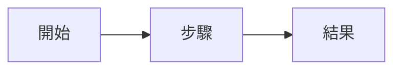

# 規格：功能名稱

狀態：草稿 · 負責人：姓名 · 更新：日期

## 問題

_現在哪裡有問題、影響誰、我們怎麼知道。_

## 目標

- _上線後會成立的事。_

## 不做的事

- _這次刻意不做的事。_

## 需求

| 編號 | 需求 | 優先度 |
|------|------|--------|
| R1 | _需求_ | 必要 |
| R2 | _需求_ | 應該 |

## 流程

## 驗收條件

- [ ] R1：_怎麼確認。_
- [ ] R2：_怎麼確認。_

## 待決問題

- _問題。_
